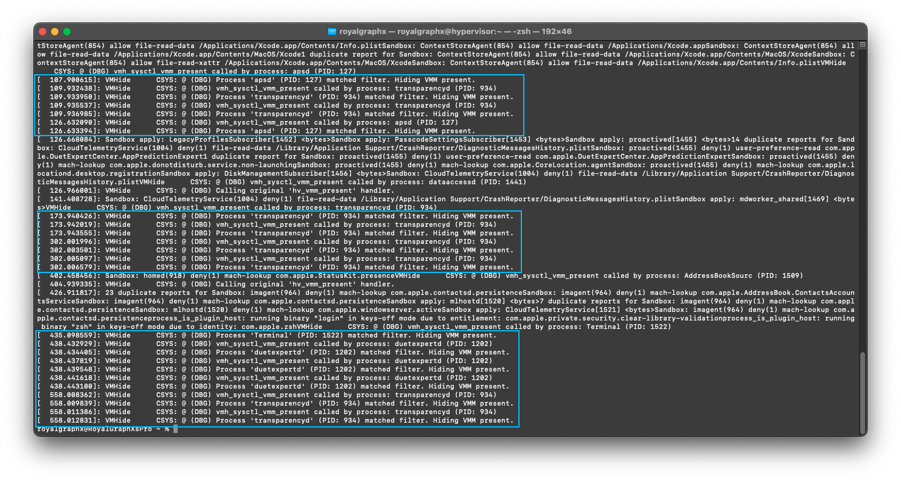
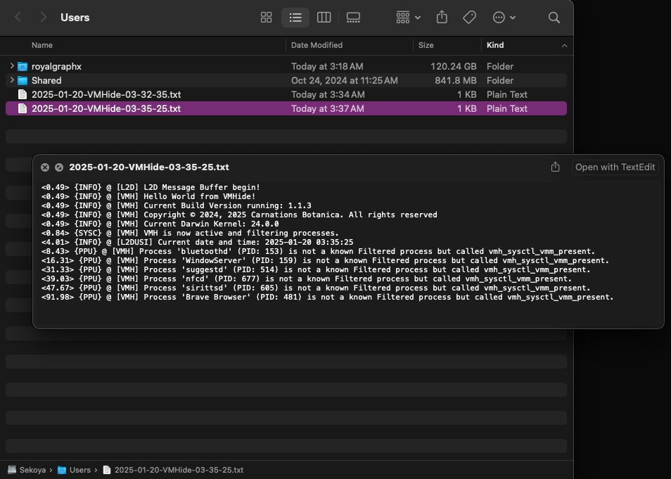

<h1 align="center">VMHide</h1>

<h5 align="center">Grants the ability to control Darwin's knowledge of a VMM's Presence.</h5>
</br>



A [Lilu](https://github.com/acidanthera/Lilu) plug-in modeled after [ECEnabler](https://github.com/1Revenger1/ECEnabler) and [RestrictEvents](https://github.com/acidanthera/RestrictEvents/) which resolves ``_sysctl__children`` to get the ``sysctl_oid_list`` for ``hv_vmm_present`` in the ``kern`` node, allowing VMHide to reroute it to a custom function: ``vmh_sysctl_vmm_present`` which selectively returns VMM presence value depending on a filtered list of known processes to hide from, including but not limited to sysctl and the Kernel itself.

</br>
<h1 align="center">Purpose</h1>
</br>

This kernel extension was developed specifically for macOS 15 Sequoia but has been tested from Sonoma (although not required) to Sequoia (15.2) with the intention of fixing a side effect of [the following new implementation for Xcode/Hypervisor.framework macOS guests on M-Series hardware supporting limited iCloud support](https://support.apple.com/en-us/120468), which can be seen in [Apple's Developer Documentation](https://developer.apple.com/documentation/virtualization/using_icloud_with_macos_virtual_machines#4412628) as well.

- Hides VMM presence from various Apple ID related processes, sysctl, and the kernel.

- Utilizes Carnation's first ProjectExtension [Log2Disk](https://github.com/Carnations-Botanica/ProjectExtensions) to provide easy bug reporting.

- Source code contains a visible list that can easily be updated and PR'd to add more.

</br>
<h1 align="center">Usage / Features</h1>
</br>

### Usage

**To use VMHide, you must be using [the latest version of Lilu](https://github.com/acidanthera/Lilu/releases) (atleast 1.7.0+ required) to properly load the plug-in.**

### Features

VMHide has a few set of possible states it can be set to. **By default, simply dropping the Kernel Extension in your kext folder and updating config.plist with ProperTree, will automatically hide VMM status if you are on a virtual machine.** To specifically set the state for **debugging** and **contributors testing code** you can add a boot argument with the following options:

``vmhState`` - Accepts the intended state of action.

- ``enabled`` -> Force hiding VMM Status. Bypasses actual VM requirement during initial boot.
- ``disabled`` -> Disable VMHide from initializing. On non-hypervisors, force spoofing as a VM.
- ``strict`` ->  Force VMM return 0 on all processes, regardless of Filter.

</br>

### Debugging, Bug Reporting, Contributing to Filter.

If you find that you're running into issues that must be reported, or wish to contribute to the list of processes that should not be VM-aware, you can use Log2Disk's support to write a local log file with information from VMHide written to easily read within macOS and for sharing the log.

</br>


</br>

``l2dEnable`` - One way switch, having this argument enables Log2Disk. 

Please allow every two minutes for the Log Buffer to sync to the Log File automatically.
</br>

``l2dLogLevel`` - Set the Log2Disk verbosity level.

- ``error`` -> Only log ERROR messages to disk.
- ``warning`` -> Only log WARNING messages to disk.
- ``info`` -> Only log INFO messages to disk.
- ``all`` -> Log all messages, even simple ones.

</br>
<b>Example boot-args for Developers/Contributors (This is not required to use VMHide)</b>

```bash
debug=0x100 -liludbgall -l2dEnable vmhState=enabled l2dLogLevel=all
```

</br>
<h1 align="center">Contributing to the Project</h1>

<h4 align="center">If you have any changes or improvements you'd like to contribute for review and merge, to update conventional mistakes or for QoL, as well as maybe even adding whole new features, you can follow the general outline below to get a local copy of the source building.</h4>

</br>

1. Install/Update ``Xcode``
    - Visit https://xcodereleases.com/ for your appropriate latest version.

2. Prepare source code
    - ``git clone --recursive https://github.com/Carnations-Botanica/VMHide.git``
    - Get the latest ``DEBUG`` Lilu.kext from [Releases](https://github.com/acidanthera/Lilu/releases) and update your EFI with it. Example Repository contents below.
        - VMHide/VMHide.xcodeproj <- Xcode Project file.
        - VMHide/VMHide/ <- Project Contents.
        - VMHide/MacKernelSDK <- Gotten by using ``--recursive``.
        - VMHide/Lilu <- Gotten by using ``--recursive``.
        - VMHide/README.md <- How you can tell you're in the root.

3. Launch ``.xcodeproj`` with Xcode to begin!
    - ``kern_start.cpp`` - Contains functions such as ``vmh_sysctl_vmm_present``.
    - ``kern_start.hpp`` - Header for Main, sets up various macros and globals and the VMH class.
    - ``log2disk.cpp`` - Contains the main Log2Disk file, and its functions.
    - ``log2disk.hpp`` - Header for Log2Disk's usage within Projects such as VMHide.

<br>
<h1 align="center">Special Thanks!</h1>
<br>

[<b>1Revenger1</b>](https://github.com/1revenger1) - Took the time to explain how to develop kernel extensions from scratch, continues to provide ways to improve the source code of VMHide including the upgrade to using onPatcherLoadForce! They have been credited as a contributor with the ``Initial Commit``.

[<b>Zormeister</b>](https://github.com/Zormeister) - Example code for onPatcherLoadForce, as well as introducing a new check for ensuring Kernel is R/W at the time of redirection of the original handler for VMM.

[<b>Lilu</b>](https://github.com/acidanthera/Lilu) - The patching engine that makes this kernel extension possible.

[<b>MacKernelSDK</b>](https://github.com/acidanthera/MacKernelSDK) - An amazing SDK used to standardize the usage of various kernel APIs across multiple versions of OS X / macOS. Makes this kernel extension possible.

[<b>ECEnabler</b>](https://github.com/1Revenger1/ECEnabler) - Served as the basis for the very first attempts building for macOS 15 and testing ideas in removed test CI commits.

[<b>RestrictEvents</b>](https://github.com/acidanthera/RestrictEvents/) - SoftwareUpdate Header file was used to learn and understand how to interact with ``_sysctl__children``. There is header code taken directly from RestrictEvents, such as Macros for the mapping of the oid list. All appropriate credit is intended to be given to whoever worked on that!

<h6 align="center">A big thanks to all contributors and future contributors! ꩓</h6>
